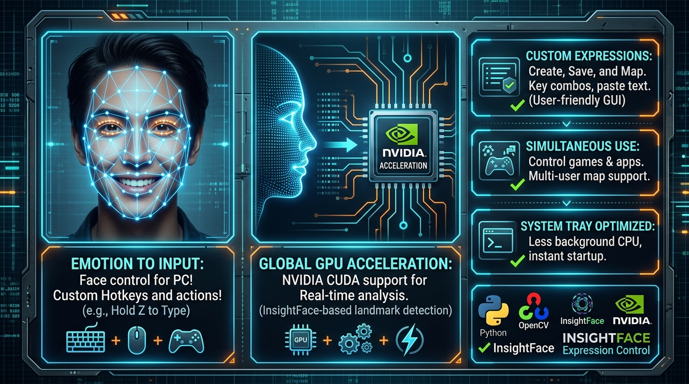

# FacialActionControl



用摄像头 + 人脸关键点做**表情控制**：先对着镜头录下几个表情（微笑、张嘴、挑眉……），之后实时识别你的表情，匹配到预设就自动触发动作——粘贴文字、按一下键、或者**一直按住某个键（适合打游戏，如 WASD 移动、空格跳跃）**。

## 功能特性

- 按 `x` 录制表情：给表情起名 + 绑定一个动作，68 个人脸关键点存入 `face_points.json`
- 按 `z` 进入实时识别：遍历所有已保存的表情，取最相似的一个
- 画面左上角实时显示相似度（绿色=达到阈值，红色=未达到）
- 三种触发动作：
  - 普通文字 → 自动粘贴（剪贴板 + `Ctrl+V`）
  - `key:w` → 按一下按键（适合跳跃/技能）
  - `key:w hold` → 按住不放，表情一停就松开（适合 WASD 移动）
- NVIDIA GPU 自动加速（CUDA），没有 GPU 自动回退 CPU
- 归一化 + 旋转对齐（Procrustes），头歪一点、离得远近都不影响识别

## 工作原理

1. 用 InsightFace 检测人脸并提取 68 个关键点
2. 归一化：质心移到原点，再除以两眼外角距离，消除位置和大小的影响
3. 旋转对齐：把当前脸旋转到和存档表情一致的角度
4. 相似度 = `1 / (1 + 平均点距离)`，默认阈值 0.9，越过阈值即触发

## 环境要求

- Windows 10/11（摄像头部分使用了 DSHOW 后端）
- Python 3.9+（在 3.13 上测试通过）
- 一个摄像头
- 可选：NVIDIA 显卡 + 驱动（没有也能跑，只是识别慢一点）

## 安装

```bash
git clone https://github.com/Elmhdmnh/FacialActionControl.git
cd FacialActionControl
pip install -r requirements.txt
```

首次运行会自动下载 InsightFace 的 `buffalo_l` 模型包（下载到 `~/.insightface`），需要联网。

## 快速开始

```bash
python main.py
```

1. 等待画面出现，人脸对准摄像头
2. 按 `x`：先输入表情名字（如“微笑”），再输入动作（见下表）
3. 重复第 2 步，多录几个表情
4. 按 `z`：进入实时识别，做表情即可触发对应动作
5. 按 `q`：退出识别 / 退出程序

## 动作语法

| 输入内容 | 触发时行为 | 示例 |
| --- | --- | --- |
| 普通文字 | 粘贴这段文字 | `hello` |
| `key:键名` | 按一下该键 | `key:w`、`key:空格` |
| `key:键1+键2` | 组合键 | `key:shift+w` |
| `key:键名 hold` | 按住直到表情不再匹配才松开 | `key:w hold` |

支持的中文键名：`空格`、`回车`、`上`、`下`、`左`、`右`。

## 配置

`main.py` 顶部的几个常量：

- `THRESHOLD = 0.9`：触发阈值。不触发就调低（如 0.85），容易误触发就调高
- `time.sleep(0.05)`：识别循环的帧率限制，机器差可以调大（如 0.1）

## 数据文件

表情保存在 `face_points.json`：

```json
[
  {
    "name": "微笑",
    "input": "key:w",
    "POINTS": [[123, 45], [130, 44], [135, 43]]
  }
]
```

`POINTS` 是 68 个 `[x, y]` 坐标，按 InsightFace 的 68 点顺序排列。

## 注意事项

1. **按键/粘贴会发送到当前有焦点的窗口**：打游戏前先点一下游戏窗口让游戏获得焦点；按 `q` 退出识别需要焦点在 `face` 窗口上。
2. 本项目绕过了 insightface 1.0.1 的一个已知 bug（`prepare(ctx_id<0)` 会把推理后端错设成 CPU）。如果以后升级 insightface 导致 GPU 失效，请检查 `main.py` 里 `set_providers` 那段代码。
3. `onnxruntime-gpu` 固定在 1.22.0（CUDA 12 编译版）；1.28 起需要 CUDA 13，如需升级请一并调整 CUDA 运行库。
4. 摄像头偶发“抓不到帧”时，程序会自动重试并重开摄像头，属正常现象，不是 bug。

## 致谢

- [InsightFace](https://github.com/deepinsight/insightface)：人脸检测与 68 点关键点模型
- [ONNX Runtime](https://onnxruntime.ai/)：推理引擎
- [PyAutoGUI](https://github.com/asweigart/pyautogui)：键盘模拟
- [OpenCV](https://opencv.org/)：图像处理与摄像头

## License

本项目使用 [MIT](LICENSE) 协议开源。

---

作者：[Elmh](https://elmh.top)
